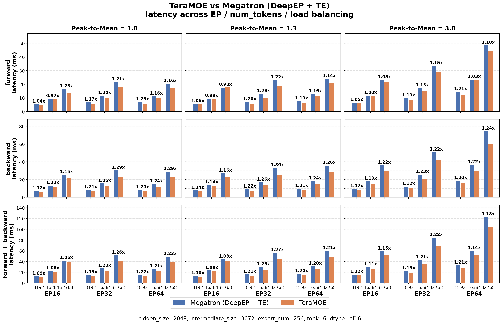
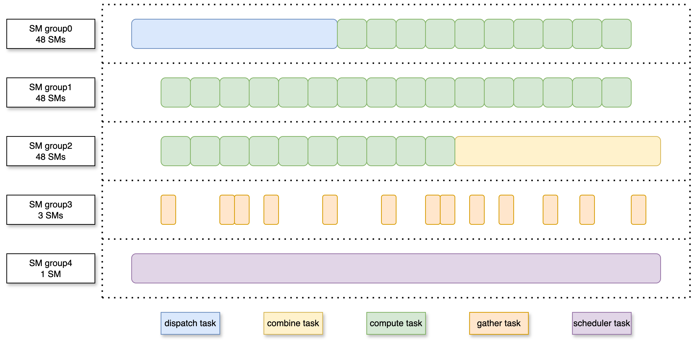

# TeraMoE

> [!WARNING]
> This repository contains an experimental version of TeraMoE. The code is still under active development, and APIs, performance characteristics, and implementation details may change.

TeraMoE is a cross-node expert-parallel MoE training library that uses a cooperative persistent kernel to overlap dispatch, expert compute, and combine.

## Performance



### Activation Memory

| num_tokens | EP | Megatron activation memory (MB) | TeraMoE activation memory (MB) | Reduction |
|:----------:|:--:|:-------------------------------:|:------------------------------:|:---------:|
| 8192 | 32 | 1126.25 | 810.55 | 28.03% |
| 16384 | 32 | 2252.48 | 1603.06 | 28.84% |
| 32768 | 32 | 4507.88 | 3201.75 | 28.83% |
| 8192 | 64 | 1122.52 | 810.59 | 27.79% |
| 16384 | 64 | 2249.35 | 1601.98 | 28.78% |
| 32768 | 64 | 4491.68 | 3207.10 | 28.6% |

## Highlights
> [!IMPORTANT]
> 
> - TeraMoE delivers up to **1.30x speedup** in communication-bound, compute-sparse regimes, matching the direction MoE architectures are evolving toward with layer-wise heterogeneous compute cost and increasingly sparse expert designs.
> - Speedup holds under expert load imbalance: at **a peak-to-mean ratio of 3.0**, TeraMoE still delivers up to **1.24x speedup**.
> - Activation memory is **reduced by 27.79%-28.84%** across EP sizes and token counts, noticeably relieving end-to-end memory pressure.

## Architecture

TeraMoE uses one persistent kernel to coordinate five types of workers.

### SM Role Layout



- **Dispatch**: routes tokens to remote experts, writes received expert inputs, and publishes token-ready signals for downstream compute.
- **Scheduler**: observes per-expert token readiness, forms compute batches, and flushes the remaining tail work after dispatch completes.
- **Compute**: executes expert computation for ready token batches, including gate/up projection, activation, and down projection.
- **Combine**: returns expert outputs to the source ranks and applies the final weighted accumulation required by MoE routing.
- **Gather**: handles local multi-hit token reduction when multiple expert results need to be accumulated for the same token.

### Execution Flow


The workers communicate through lightweight readiness signals. Dispatch publishes `token ready` signals, the scheduler groups ready tokens into compute batches, and compute publishes results to combine. When a token has multiple local expert hits (`nhit > 1`), gather reduces those partial results before combine consumes them.

## TODO

- [ ] Support PaddlePaddle
- [ ] Add FP8 support.
- [ ] Migrate the communication backend from NVSHMEM to NCCL.
- [ ] Add SM90 support.

## Quick start

### Requirements

- SM100 GPUs
- Python 3.12 and above
- CUDA toolchain with SM100 support
- PyTorch 2.1 and above
- RDMA-capable network for cross-node communication
- NVSHMEM installed

### Install NVSHMEM

TeraMoE depends on NVSHMEM. See the [NVSHMEM Installation Guide](third-party/README.md).

### Install

```bash
MK_COMPUTE_KERNEL=1 python -m pip install -v .
```

## Training API

```python
import torch
import torch.distributed as dist
import teramoe

group = dist.group.WORLD
num_sms = torch.cuda.get_device_properties(torch.cuda.current_device()).multi_processor_count
buffer = teramoe.Buffer(
    group,
    int(2e9),
    int(1e9),
    low_latency_mode=False,
    num_qps_per_rank=num_sms,
    explicitly_destroy=True,
)

output = buffer.teramoe_autograd(
    x,
    topk_idx,
    topk_weights,
    W_gateup,
    W_down,
    num_experts,
    num_dispatch_sms=48,
    num_combine_sms=48,
    total_sms=num_sms,
    stage=1,
    compute_batch_size=4096,
    combine_start_head_percent=70,
)
output.backward(torch.randn_like(output))

buffer.destroy()
```

## Acknowledgement

TeraMoE is developed based on [DeepEP](https://github.com/deepseek-ai/DeepEP) and [DeepGEMM](https://github.com/deepseek-ai/DeepGEMM), and is inspired by [UniEP](https://arxiv.org/abs/2604.19241) and [SonicMoE](https://github.com/Dao-AILab/sonic-moe). We sincerely thank the authors and contributors of these projects for their work.

## License

This code repository is released under [the MIT License](LICENSE), except for code that references NVSHMEM (including `csrc/kernels/ibgda_device.cuh` and `third-party/nvshmem.patch`), which is subject to the [NVSHMEM SLA](https://docs.nvidia.com/nvshmem/api/sla.html). Code derived from [DeepEP](https://github.com/deepseek-ai/DeepEP) in `csrc/kernels` is subject to the license in the DeepEP repository.
